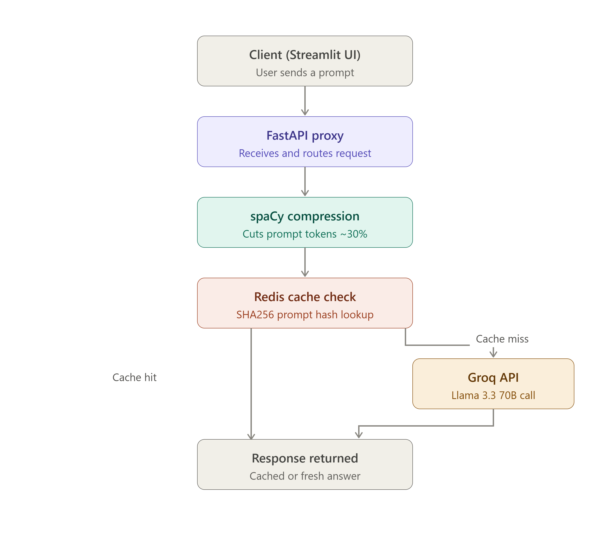

# ContextGuard

A FastAPI middleware that sits between your application and the Groq API to reduce LLM API costs — through prompt compression and response caching — without changing how you call the model.

## The Problem

Every call to an LLM API costs money based on token count. Two of the biggest sources of waste in real applications:
1. **Repeated system prompts** — sent in full on every single request, even though most of it never changes.
2. **Duplicate requests** — the same question asked twice still costs full price the second time, even though the answer hasn't changed.

ContextGuard sits in front of your Groq calls and addresses both.

## How It Works

ContextGuard exposes a single endpoint, `/v1/chat/completions`, shaped like Groq's own chat completions API. Point your app at ContextGuard instead of Groq directly, and it transparently:

1. **Compresses system prompts** using spaCy-based NLP compression before they're sent
2. **Checks a Redis cache** for an identical prior request — if found, returns instantly with zero tokens spent
3. **Forwards to Groq** only on a cache miss, and counts tokens before/after using `tiktoken`
4. **Caches the response** for future identical requests


## Results (observed during manual testing)

- **~38% token reduction** on system prompts after compression
- **Cache hits return `total_tokens: 0`** — no Groq API call made, response served directly from Redis

These numbers come from manual testing during development, not a formal benchmark suite.

## Architecture



**Cache key generation:** the full message list (system + user content) is serialized with `json.dumps(messages, sort_keys=True)` and hashed with SHA256. Hashing the entire message list — not just one message — prevents different conversations from colliding on the same cache key. `sort_keys=True` ensures identical content in a different key order still produces the same hash.

## Tech Stack

- **FastAPI** — HTTP proxy layer
- **Redis** (via Docker) — response caching
- **spaCy** — system prompt compression
- **tiktoken** — token counting
- **httpx** — async forwarding to Groq
- **Groq API** (Llama 3.3 70B) — underlying LLM

## Setup

### Prerequisites
- Python 3.10+
- Docker Desktop (for Redis)
- A Groq API key ([console.groq.com](https://console.groq.com))

### 1. Clone and install dependencies

```bash
git clone <your-repo-url>
cd contextguard
python -m venv venv
venv\Scripts\activate        # Windows
# source venv/bin/activate   # macOS/Linux
pip install -r requirements.txt
python -m spacy download en_core_web_sm
```

### 2. Set environment variables

Create a `.env` file in the project root:

```
GROQ_API_KEY=your_groq_api_key_here
```

### 3. Start Redis via Docker

```bash
docker run -d --name redis-contextguard -p 6379:6379 redis
```

Verify it's running:

```bash
docker exec -it redis-contextguard redis-cli ping
# should return: PONG
```

If the container already exists from a previous run, use `docker start redis-contextguard` instead.

### 4. Start the FastAPI server

```bash
uvicorn main:app --reload
```

Server runs at `http://127.0.0.1:8000`.

### 5. Send a test request

```powershell
Invoke-RestMethod -Uri "http://127.0.0.1:8000/v1/chat/completions" -Method Post -ContentType "application/json" -Body '{"model": "llama-3.3-70b-versatile", "messages": [{"role": "user", "content": "What is 2+2?"}]}'
```

Send the exact same request again — the second response should show `"total_tokens": 0` in `token_report`, confirming the cache hit.

## Status

Core functionality (compression, token counting, caching) is complete and manually tested end-to-end. Not yet integrated into a production application. Planned next steps: automated tests, structured error handling, and Docker packaging for the FastAPI app itself (Redis is already containerized).

## Author

Built by Sagar Mallappa Jarali as a hands-on project while transitioning into AI engineering.
